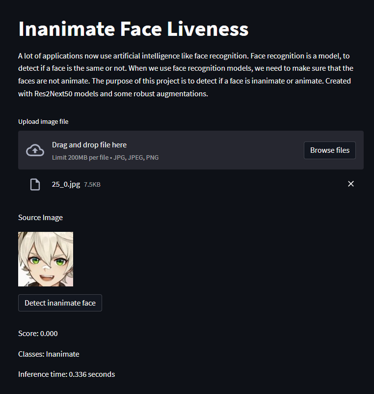

# Inanimate Face Liveness



## Description

A lot of applications now use artificial intelligence like face recognition. Face recognition is a model, to detect if a face is the same or not. When we use face recognition models, we need to make sure that the faces are not animate. The purpose of this project is to detect if a face is inanimate or animate. Created with Res2Next50 models and some robust augmentations.

## Installation

```bash
# Python version 3.7.9 or newer
$ git clone https://github.com/hafidh561/inanimate-face-liveness.git
$ pip3 install -r requirements.txt
$ python3 download_model.py
```

## Usage

```bash
$ streamlit run app.py
usage: app.py [-h] [-d DEVICE] [-m MODEL]

optional arguments:
  -h, --help            show this help message and exit
  -d DEVICE, --device DEVICE
            Input your device inference between CPU or CUDA
  -d MODEL, --model MODEL
            Path to model onnx

# Example arguments input
$ streamlit run app.py -- --device CUDA --model model.onnx
```

## License

[MIT LICENSE](./LICENSE)

© Developed by [hafidh561](https://github.com/hafidh561)
